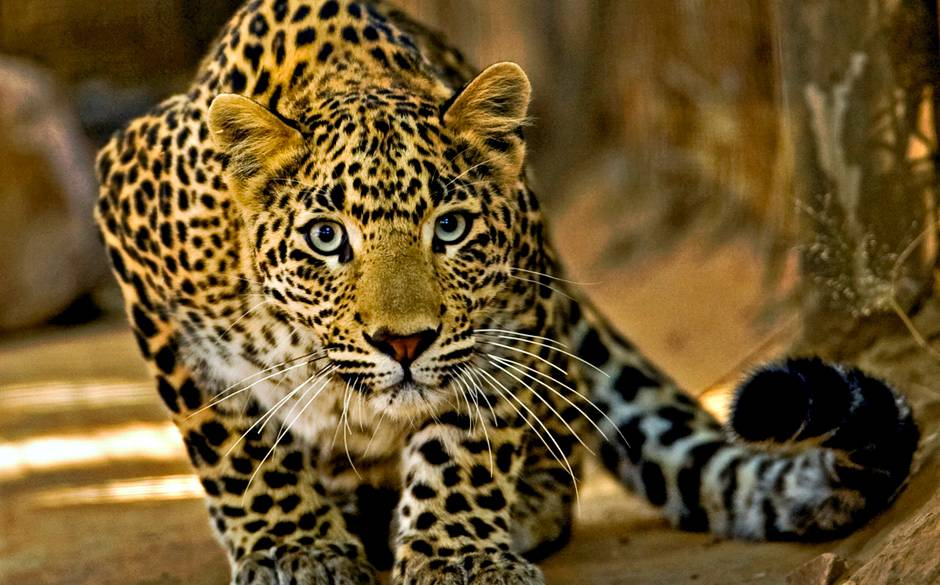

# Leopard
First Page - part of Big Data Course

Hi Folks,  
This is my Page about Leopard.

[A little bit from Wikipedia](https://en.wikipedia.org/wiki/Leopard)

## About Leopard
1. Leopard is a very dangerous animal!
2. The cheese flavoured snack "Cheetos" using a cartoon Leopard
3. The Leopard is listed as a vulnerable on the IUCN Red List because leopard populations are threatened by habitat loss and fragmentation, and are declining in large parts of the global range.
4. One of the five "Big Cats" in the genus Panthera.
## Areas of distribution
- sub Saharan Africa
- parts of Asia

## Gallery
  

## Subspecies  
Hebrew Name | English Name
------------|--------------
נמר אפריקאי | African leopard
נמר הודי | Indian leopard
נמר ערבי | Arabian leopard
